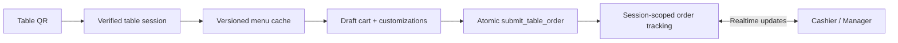

# King's Café · Customer Ordering

Mobile-first QR ordering for guests at a café table. Customers scan a table QR code, browse the live menu, choose customizations, submit one combined order, and track preparation in real time.


## Product flow



## Highlights

- Cafe- and table-scoped sessions protected by Supabase RLS.
- Server-authoritative prices, availability, modifiers, and idempotent order submission.
- Persistent IndexedDB menu cache with catalog version checks and offline-friendly warm reloads.
- Realtime order/item status updates with bounded reconciliation after reconnect.
- Arabic-first customer experience with safe English fallback for catalog labels.
- Mobile HTTP-safe UUID generation for local-network QR usage.

## Architecture

| Layer | Location | Responsibility |
|---|---|---|
| Routes | `src/app` | Next.js App Router screens |
| Features | `src/features` | Menu, cart, sessions, tracking, billing, service requests |
| Data access | `src/features/**/services` | Supabase queries, RPC calls, realtime channels |
| Shared | `src/shared` | Browser client, resilient images, UUID and shared helpers |
| Database | `supabase/migrations` | RLS, RPCs, triggers, realtime publication, catalog versioning |

See the full system map in [`docs/architecture.md`](docs/architecture.md).

## Local setup

```bash
npm ci
copy .env.example .env.local
npm run dev
```

Required public variables:

```env
NEXT_PUBLIC_SUPABASE_URL=...
NEXT_PUBLIC_SUPABASE_ANON_KEY=...
NEXT_PUBLIC_CAFE_ID=...
```

Never commit `.env.local`, service-role keys, customer tokens, or generated build output.

## Verification

```bash
npm run typecheck
npm run lint
npm run build
npx playwright test tests/e2e/egress-idle-smoke.spec.ts
```

The full lifecycle Playwright test requires explicit local test credentials and must only target a disposable test table/session.

## Related application

The cashier and manager application lives in [`coffee_manager`](https://github.com/ebrahimElsayd/coffee_manager).
