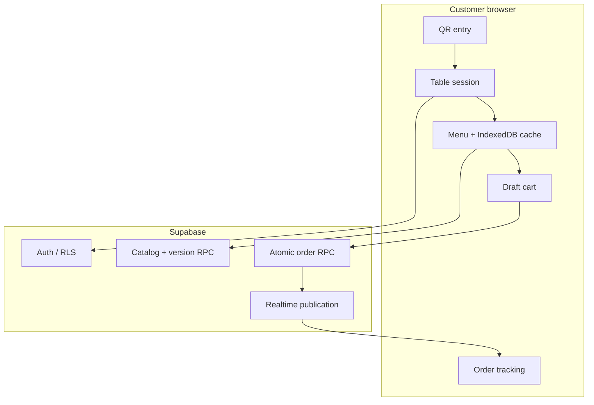

# Customer system map

```mermaid
flowchart TB
  subgraph Browser[Customer browser]
    QR[QR entry]
    Session[Table session]
    Menu[Menu + IndexedDB cache]
    Cart[Draft cart]
    Tracking[Order tracking]
  end
  subgraph Supabase[Supabase]
    Auth[Auth / RLS]
    Catalog[Catalog + version RPC]
    OrderRPC[Atomic order RPC]
    Realtime[Realtime publication]
  end
  QR --> Session
  Session --> Auth
  Session --> Menu
  Menu --> Catalog
  Menu --> Cart
  Cart --> OrderRPC
  OrderRPC --> Realtime
  Realtime --> Tracking
```

Trust boundaries: prices and availability are validated in PostgreSQL; the browser never supplies an authoritative total.
